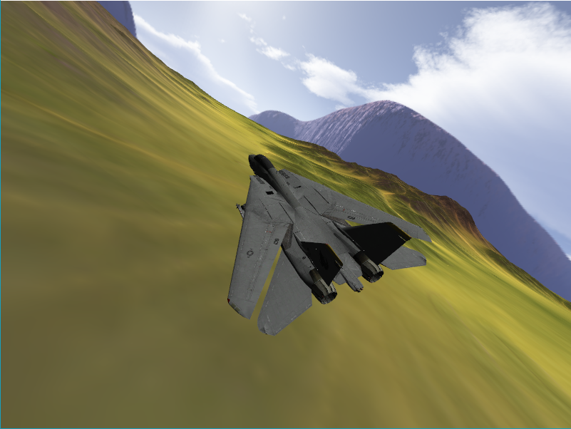

# JetSimulator 

3d flight simulator, started as a college project.

# Roadmap
[ ] move all effects to framebuffers, generalize post processing

[ ] sounds

[ ] wings movement

[ ] motion blur

[ ] particle effect

# Build

Runs only on windows, tested on win10.

run latest version of cmake, make sure the target arch is x64(Win64).

If you are using Visual Studio 2015 you can run htis:

`$ cmake -S. -Bbuild -G "Visual Studio 14 2015 Win64"`

If you are using visual studio 2017: 

`$ cmake -S. -Bbuild -G "Visual Studio 15 2017 Win64"`

then open the solution in `/build` or if you have make, run `$ make build run`.

# Credits

TODO
