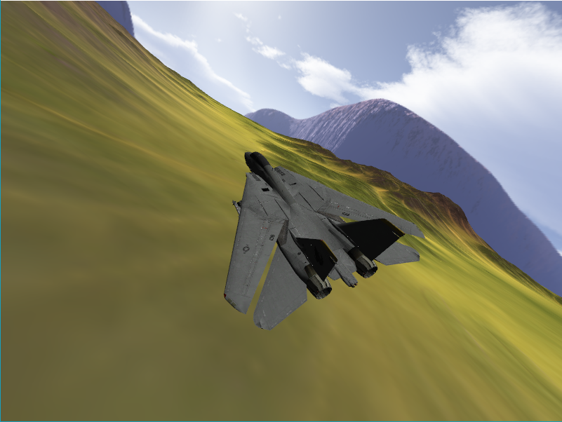

# JetSimulator 

3d flight simulator, started as a college project.



# Dependencies
| Dependency       | Version     |
|------------------|-------------|
| cmake            | `3.13.4+`   |
| libglfw3-dev     | `3.2+`      |
| libfreetype6-dev | `2.9.0+`    |
| libassimp-dev    | `4.1.0+`    |
| libstb-dev       | `20180212+` |
| libglm-dev       | `0.9.8.5+`  |
| libgladeui-dev   | `0.1.29+`   |
| libopenal-dev    | `1.19.0+`   |

On debian based distro:
```sh
$ sudo apt update && sudo apt install -y \
    cmake \
    libglfw3-dev \
    libfreetype6-dev \
    libassimp-dev \
    libstb-dev \
    libglm-dev \
    libgladeui-dev \
    libopenal-dev
```

# Build

```sh
$ mkdir -p build &&
    cd build &&
    cmake .. &&
    make -j$(nproc --all)
```

# Run
In build:
```sh
$ ./JetSimulator
```
